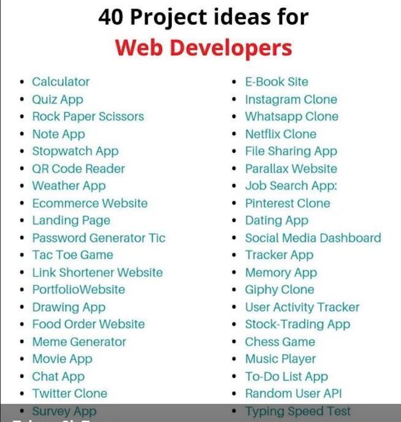

# ydu-202-searchapp

## Sample Project in python

To demonstrate the coding ability, 
we decided to use this list for our source of ideas
for junior projects in python

## Calculator

The implementaion for statefull and stateless caculator is
placed here [./calculator_engine](./calculator_engine)

## Search Application

We would like to search words in db very fast

See: [./ydusearch](./ydusearch)

> We divide web server development into number of lessons

### Lesson 1. Client Server. Sockets

## Image Search

A search application by text image or semantic request
